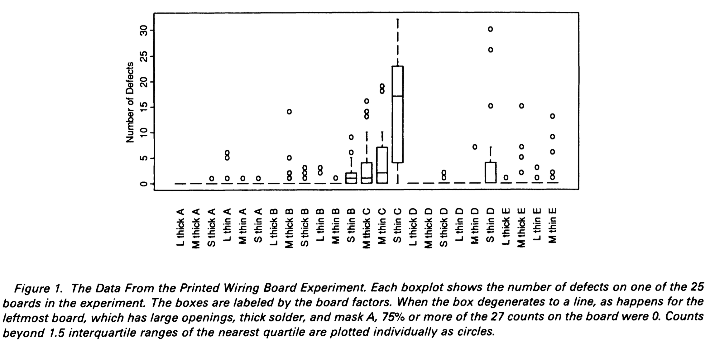
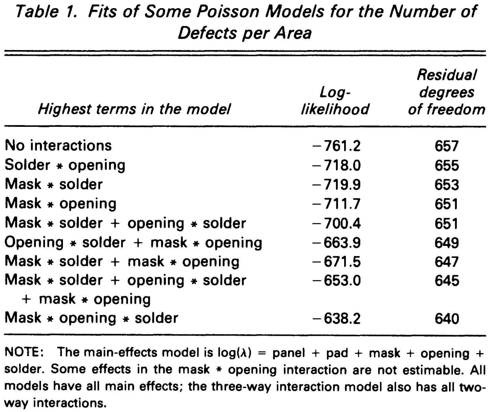
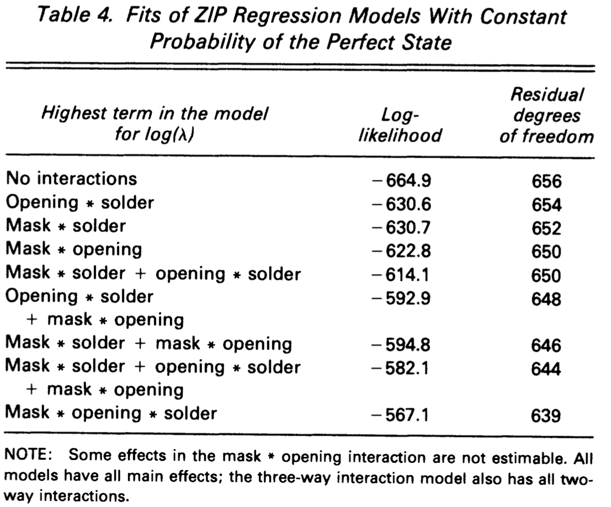
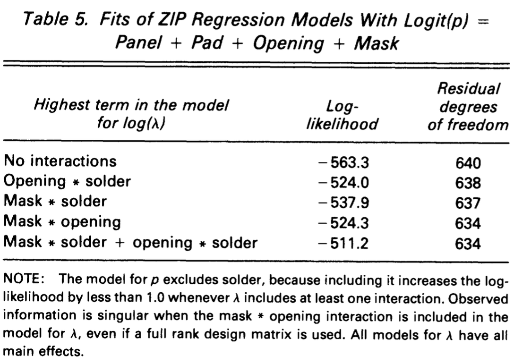
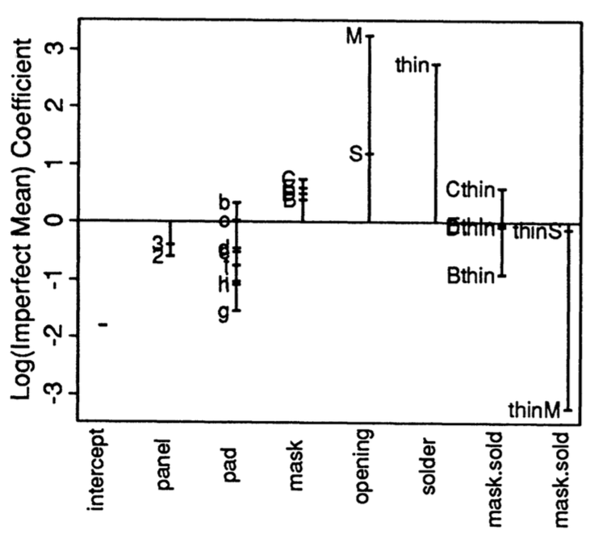
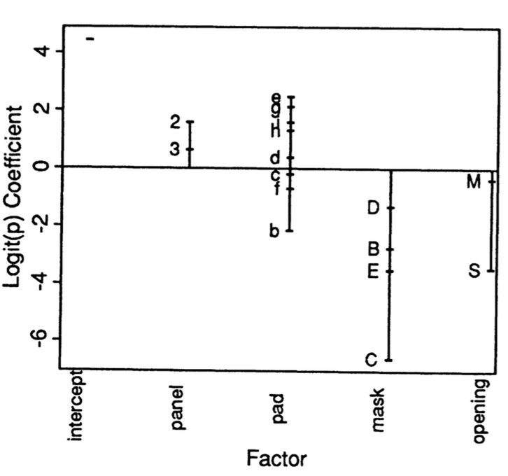
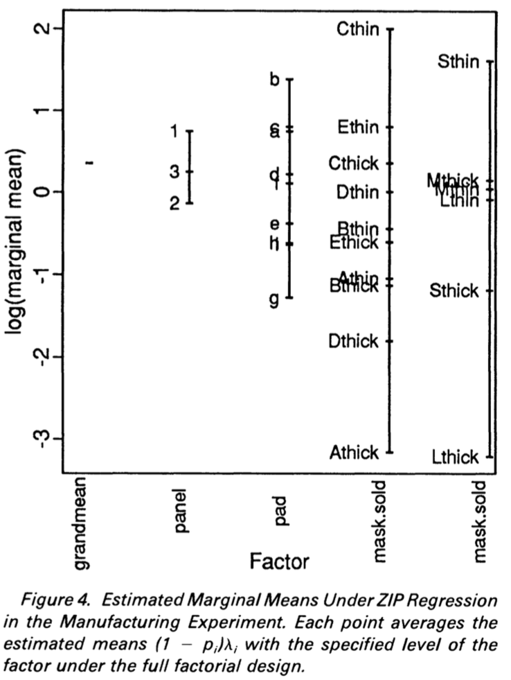

```{r setup, include=FALSE}
knitr::opts_chunk$set(echo = FALSE)
```

## Choosing a paper {.flexbox .vcenter}


## Choosing a paper {.flexbox .vcenter}


## Choosing a paper {.flexbox .vcenter}


# Lambert, D. Zero-Inflated Poisson Regression, with an Application to Defects in Manufacturing. _Technometrics_ 34, 1–14 (1992)

## The problem

> - Want to estimate the rate of failure in a manufacturing process
> - Produce $n$ items with $Pr(i^{th} \text{ item has } k \text{ defects}) = \frac{\lambda^{k} e^{-\lambda}}{k!}$
> - Expect $n e^{-\lambda}$ items with zero defects for large $n$
> - Observe $< n e^{-\lambda}$ items with zero defects
> - What do?

## Option 1: I am a genius {.flexbox .vcenter}


## Option 2: I am not a genius {.flexbox .vcenter}


## Option 3: Zero inflated counts {.columns-2 .build}

### Sometimes


### Othertimes


## Application {.flexbox .vcenter}


## Application {.smaller}

> - Variables
    - `mark` (type of surface of board): _A_ - _E_
    - `opening` (clearance in mask around pad): _L_, _M_, _S_
    - `solder`: _thick_, _thin_
    - `pad`: _A_ - _I_
    - `panel` (order of parts soldered to board): _1_, _2_, _3_
> - Design
    - _Split-plot_ experimental design
    - 30 boards, each partitioned into 3 panels, each panel subdivided into 9 areas
    - Different `pad` on each panel with same pattern across panels
    - 48 solder joins per area
    - 25/30 boards available for analysis -> unbalanced experiment
> - Response
    - $\mathbf{Y} = (Y_{1}, \ldots, Y_{27 \times 25})$, $Y_{i} \in \{0, \ldots, 48 \} = \text{# failed joins in } i^{th} \text{ area}$
    - Small probability of failure and "many" joins per area -> Poisson approximation 
    
## Data



## Log-linear model (Poisson regression) {.columns-2 .build}



> "Even the richest model ... predicts poorly ... underpredicts large counts ... too many zeros and too many large counts for data to be Poisson"

## Zero inflated Poisson (ZIP)

> - ZIP has been around since the 1960s
> - Let $Y_{i}$ = the number of defects in the $i^{th}$ item
> - $Pr(Y_{i} = k) = p_{i} \delta_{0}(k) + (1 - p_{i}) \frac{\lambda_{i}^{k} e^{-\lambda_{i}}}{k!}$
    - $0 < p_{i} < 1; \lambda_{i} > 0; k = 0, 1, \ldots$
    - $Pr(Y_{i} = 0) = p_{i} + (1 - p_{i}) e^{-\lambda{i}}$
    - $Pr(Y_{i} = k) = (1 - p_{i}) \frac{\lambda_{i}^{k} e^{-\lambda_{i}}}{k!}$
> - Say that the system is in the _perfect_ state with probability $p_{i}$
> - $p_{i}$ unknown and not directly observable

## Procrastination

```{r rzip}
inputPanel(
  sliderInput("lambda", label = "lambda:",
              min = 0, max = 20, value = 5, step = 1),
  
  sliderInput("p", label = "p:",
              min = 0, max = 1, value = 0.0, step = 0.05)
)

renderPlot({
  n <- 1000
  U <- runif(n)
  n_perfect <- sum(U < as.numeric(input$p))
  x <- c(rep(0, n_perfect), 
         rpois(n - n_perfect, input$lambda))
  plot(table(x) / sum(x), ylim = c(0, 0.3), xlim = c(0, 35), xlab = "k", 
       ylab = "Proportion")
})
```

## So what's new, Lambert?

> - ZIP __regression__
> - Allow $p$ and $\lambda$ to depend on covariates
    - $p$ and $\lambda$ may depend on _different_ covariates
    - $p$ and $\lambda$ may or may not be functionally related

## Parameterisation

> - ZIP 
    - $\mathbf{p} = (p_{1}, \ldots, p_{n})^{'}, \mathbf{\lambda} = (\lambda_{1}, \ldots, \lambda_{n})^{'}$
    - $\log(\mathbf{\lambda}) = \mathbf{B \beta}$
    - $logit(\mathbf{p}) = \log(\frac{\mathbf{p}}{1 - \mathbf{p}}) = \mathbf{G \gamma}$
    - $\mathbf{B}$ and $\mathbf{G}$ are covariate matrices
> - ZIP$(\tau)$
    - $\log(\mathbf{\lambda}) = \mathbf{B \beta}$
    - $logit(\mathbf{p}) = - \tau \mathbf{B \beta}$
    - Implies $p_{i} = (1 + \lambda_{i}^{\tau})^{-1}$
    
## ZIP: maximum likelihood estimation {.flexbox .vcenter}

__Math Happens™__

## ZIP: maximum likelihood estimation {.smaller}

> - $p_{i}$ is unobserved
    - Likelihood for $\mathbf{B, G}$ is _incomplete_
> - Suppose we could observe $Z_{i} = 1$ if $Y_{i}$ is from perfect state and $Z_{i} = 0$ otherwise.
    - Construct _complete data likelihood_
> - Maximise incomplete data likelihood using _expectation maximisation_ (EM) algorithm
    1. Initialise $\mathbf{B, G}$
    2. Compute expectation of $Z_{i}$ using current estimates of $\mathbf{B, G}$
    3. Maximise likelihood using current expectation of $Z_{i}$
    4. Repeat 2 & 3 until convergence of estimates of $Z_{i}$
> - __Magic__ 
    - When $Z_{i}$ converge so to do $\mathbf{B, G}$ (our final MLEs)
    - But see details
> - Modern ZIP regression implementations (e.g., [VGAM](https://cran.r-project.org/web/packages/VGAM/index.html)) use Fisher scoring rather than EM algorithm

## ZIP$(\tau)$: maximum likelihood estimation

- Can't use EM, use Newton-Raphson algorithm instead

## Standard errors, asymptotic theory, and simulations {.flexbox .vcenter .build}

### ap·pen·di·ci·tis /əˌpendəˈsīdəs/ _noun_

> - a serious medical condition in which the appendix becomes inflamed and painful.
> - a serious medical condition in which the reader becomes distracted reading proofs in the appendix and instead Googles stupid gifs. Closely related to _amet sed maxime simulatione dormitationem_. Mostly self-inflicted.

## Application (slight return) {.columns-2 .build}





## Parameter interpretation {.flexbox .vcenter}



## Parameter interpretation {.flexbox .vcenter}



## Parameter interpretation {.flexbox .vcenter}



## Alternative models {.smaller}

> - Negative binomial (overdispersed Poisson)
    - Poisson model but with random variation in $\lambda_{i}$ across 25 boards
    - Demonstrate that such random variability exists
    - But not as good as ZIP
    - Tried ZINBA but unsuccessful at fitting to data
> - ZIP$(\tau)$
    - Better than Poisson but not as good as ZIP
    - Fewer parameters -> potentially simpler interpretation (but not in this case)
    - Engineers preferred decoupling effects in perfect and imperfect states
    - ZIP gave results more closely matching the engineers prior experience
> - Hurdle Poisson
    - $Y_{i} = 0$ with probability $p_{i}$ and $Y_{i}$ is distributed as positive-Poisson($\lambda_{i}$) with probability $(1 - p_{i})$

## Generalisations

> - Mixture models
> - $Pr(Y = y) = \sum_{k = 1}^{K} p_{k} F_{m}(Y = y)$
    - $0 < p_{k} < 1, \sum_{k = 1}^{K} p_{i} = 1$
    - $F_{k}(Y = y)$ is the distribution for the $k^{th}$ component (with a set of parameters)

## My interest

